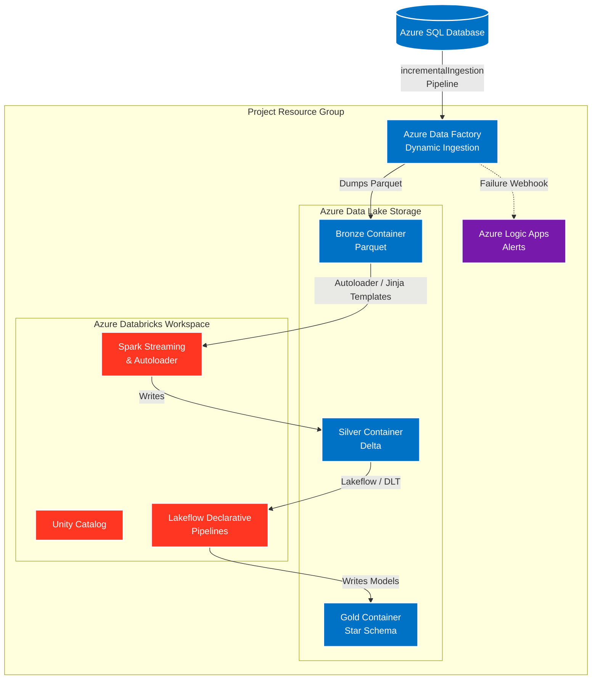

# 🎵 Spotify Lakehouse: Delta Live Tables, Autoloader & CI/CD

> An advanced, enterprise-grade data engineering solution processing a **Spotify Dataset**. This project leverages a metadata-driven Medallion Architecture featuring dynamic Azure Data Factory pipelines with backfilling capabilities, Databricks Autoloader for streaming ingestion, Delta Live Tables (DLT) for dimensional modeling, and Databricks Asset Bundles (DABs) for robust CI/CD.

---

## 🏗️ Architecture Overview

## 🚀 Deployed Resources

| Resource Type | Purpose in Project |
| :--- | :--- |
| **Azure Data Factory (ADF)** | Orchestrates dynamic, parameterized data ingestion from SQL to ADLS, handling both incremental CDC loads and historical backfilling. |
| **Azure Databricks** | The core compute engine, utilizing PySpark, Structured Streaming, and Delta Live Tables to process data. |
| **Databricks Access Connector** | Provides a System Managed Identity to allow Unity Catalog secure, keyless access to the Data Lake. |
| **Azure Data Lake Storage (ADLS)** | The central storage layer logically separated into `Bronze`, `Silver`, and `Gold` zones. |
| **Azure SQL Server & Database** | Acts as the primary transactional source system holding the raw Spotify dataset. |
| **Azure Logic Apps** | Configured to catch pipeline failures and send automated alerts to the engineering team. |

## 🧠 Core Engineering Concepts Implemented

To build a truly scalable enterprise pipeline, this project strictly adheres to the following paradigms:

1. **Incremental Processing:** Instead of truncating and reloading data, the pipeline only processes new or updated records. This is achieved via ADF watermarking (CDC JSON) on the extraction side and Databricks Autoloader on the processing side.
2. **Metadata Driven Code:** Utilizing the **Jinja** templating library in Databricks, pipelines dynamically generate Spark code based on configuration files rather than relying on hardcoded scripts.
3. **Git CI/CD Standards:** Code is version-controlled via Git branches and deployed systematically using **Databricks Asset Bundles (DABs)**, treating infrastructure and notebooks as deployable code.
4. **Backfilling Enabled:** The ADF pipeline is designed to gracefully handle historical data re-loads on demand without breaking the standard incremental flow.
5. **Custom Utilities:** Built custom Python helper functions within Databricks to handle repetitive tasks (like schema evolution and logging) for large-scale data processing.
6. **Star Schema:** A dimensional modeling technique applied in the Gold layer, separating business metrics (Facts) from descriptive attributes (Dimensions) to optimize analytics.
7. **Dynamic Code:** Pipelines in both ADF and Databricks adapt at runtime based on parameters, If/Else logic, and metadata loops.

## 🏅 Pipeline Architecture & Workflow

### 1. Bronze Layer (Dynamic ADF Ingestion from SQL Database)
The extraction is handled by a highly dynamic ADF pipeline named **`incrementalIngestionPipeline`**, which connects directly to an **Azure SQL Database** as the primary source system. 

* **The Logic:** The pipeline relies on a CDC JSON file stored in the data lake that contains a watermark date (initially set to `1900-01-01`). To control the flow, an **If Condition** evaluates a pipeline parameter named `from_date`. 
* **Incremental Path:** If the `from_date` parameter is left empty, the pipeline executes a standard incremental load. It queries the SQL Database for any records where the timestamp is greater than the JSON watermark, updates the watermark file to the new `MAX(updated_at)`, and securely copies the newly ingested data as Parquet files into the Bronze container.
* **Backfill Path:** If a specific date is provided in the `from_date` parameter, the pipeline intelligently bypasses the normal CDC logic and pulls the requested historical data from the SQL Database, allowing for seamless historical data backfilling without breaking the incremental watermark.

### 2. Silver Layer (Streaming & Metadata-Driven Processing)
* **Ingestion:** Databricks reads the raw Parquet files from Bronze using **Spark Structured Streaming** and **Autoloader**. This ensures highly scalable, incremental processing of new files as they arrive in the data lake.
* **Metadata Driven Pipeline (Jinja):** Instead of writing static PySpark code, I created a **Meta Data Driven Pipeline** using the **Jinja** templating library. This dynamically generates the transformation logic based on configurations. Combined with Python custom utilities, the pipeline cleans and standardizes the data before writing it to the Silver container as Delta tables.

### 3. Gold Layer (Lakeflow Declarative Pipelines & DLT)
* **Lakeflow Declarative Pipelines:** For the final polished layer, the architecture abandons traditional imperative notebook coding in favor of **Lakeflow Declarative Pipelines** using **Delta Live Tables (DLT)**. 
* **Star Schema & SCDs:** These declarative pipelines construct a robust **Star Schema**, handling Slowly Changing Dimensions (SCDs) automatically. 
* **Data Quality (Expectations):** **DLT Expectations** are applied natively to enforce strict Data Quality checks (e.g., dropping or quarantining invalid records).

## 🔐 Security & Unity Catalog Setup

This project enforces strict data governance by avoiding hardcoded access keys:
1. Created a **Unity Catalog Metastore** linked to the Databricks workspace.
2. Configured the Metastore with a managed storage path pointing to the ADLS container.
3. Utilized the **Databricks Access Connector** to generate a secure **Storage Credential**.
4. Built an **External Location** on top of the storage credential, allowing the Databricks workspace to securely read raw files and write transformed data purely via managed identity RBAC permissions.
